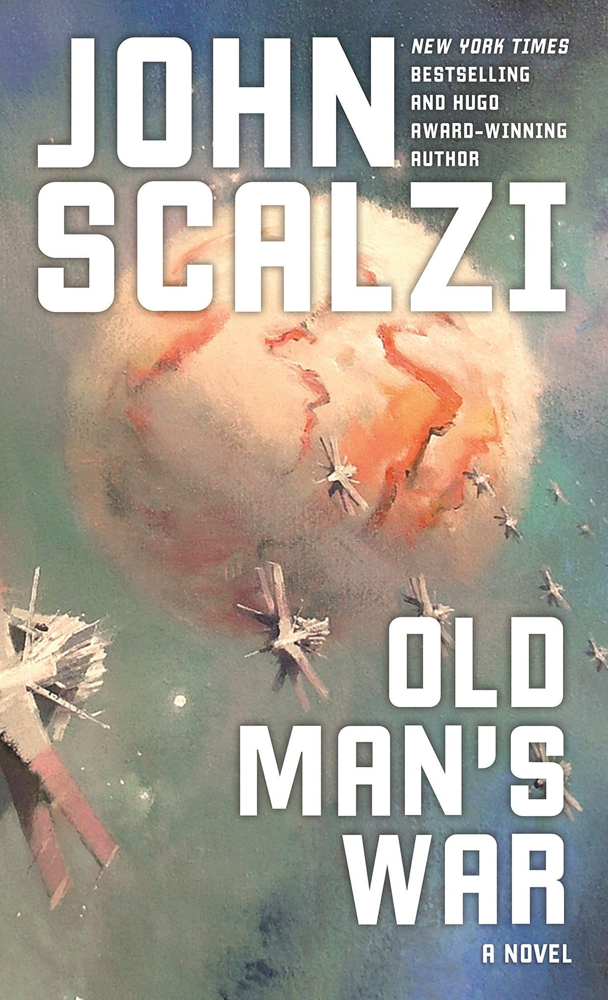

# Book Review : Old Man's War by John Scalzi

### Rating : 10/10
Sci-fi, Comedy

Hitchhickers guide to the Galaxy meets Stormship troopers! Old Man's War is brilliantly written! Scalzi has some of the freshest and most unique take on future tech I've come across in a while.

Premise of the story is people who turn 75 can apply for the colonial forces, but have to give up everything they know. In exchange they get a fresh new body for as long as they serve in the fleet. During their stay they fight several diverse and sometimes brutal types of aliens.